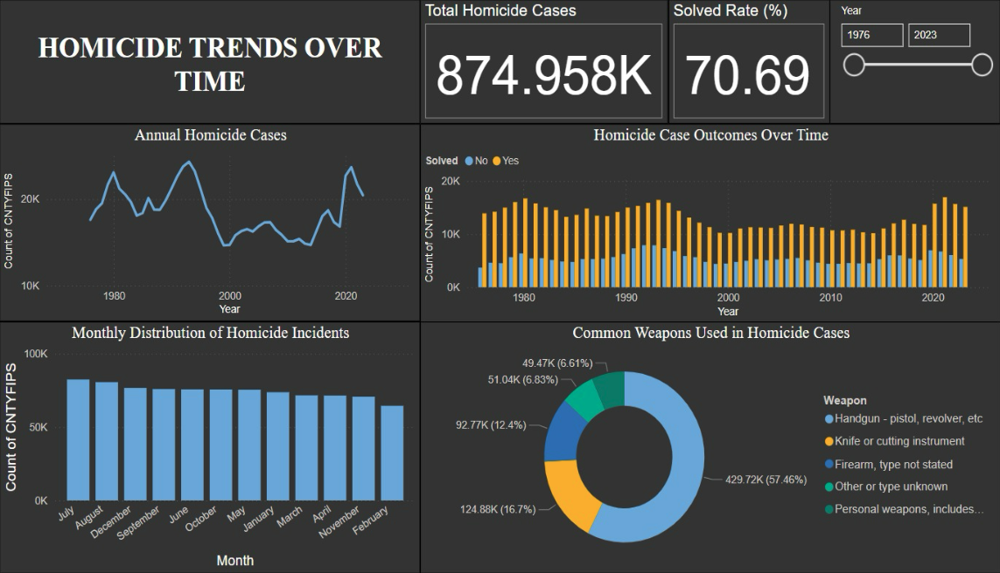
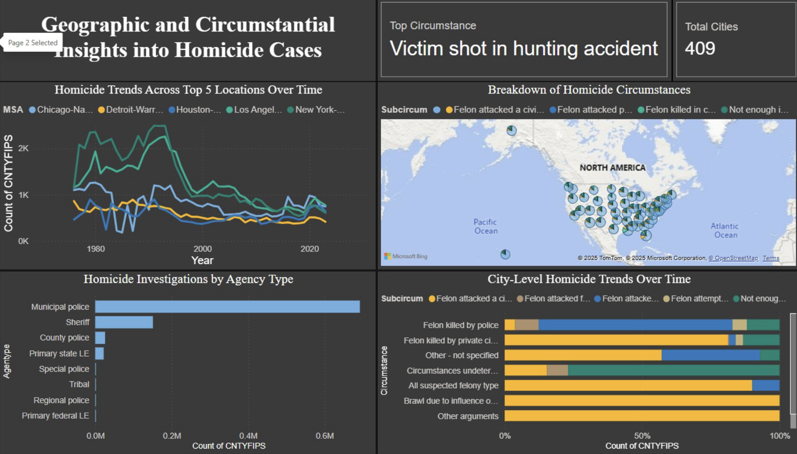
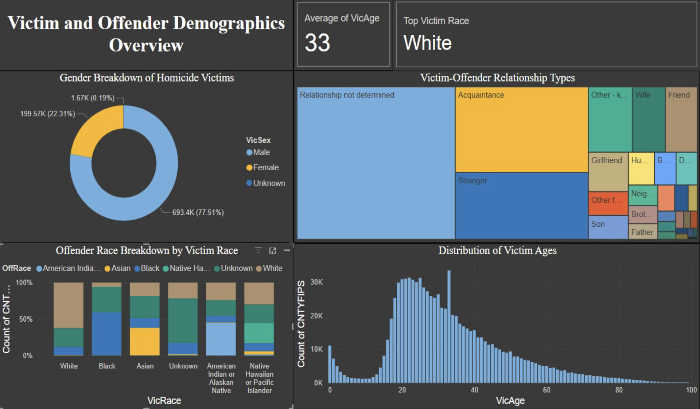

# U.S.-Homicide-Data-Analysis-using-Power-BI
This project analyses nearly six decades of U.S. homicide data to uncover patterns in crime trends, demographics, and geographic distribution.   Using Power BI, I built interactive dashboards to transform large-scale raw data into actionable insights that can support public safety strategies and policy decisions.

---

## Dataset

- Source: Murder Accountability Project (Supplementary Homicide Report)
- Time Range: 1965 – 2023
- Records: ~874,000+
- Features: 30+ variables including victim/offender demographics, weapon type, location, and case status

---

## 📸 Dashboard Previews

### Dashboard 1: Homicide Trends Over Time

---

### Dashboard 2: Geographic & Circumstantial Insights

---

### Dashboard 3: Victim & Offender Demographics

---

## Tools & Technologies

- Power BI (Data Visualisation & Dashboarding)
- DAX (Calculated Measures)
- Data Cleaning & Transformation
- CSV Data Handling

---

## Key Dashboards

### 1. Homicide Trends Over Time
 - Annual homicide trends (1976–2023)
 - Solved vs unsolved cases (~70% solved rate)
 - Monthly distribution (seasonal patterns)
 - Weapon usage analysis

### 2. Geographic & Circumstantial Insights
 - Trends across major U.S. cities
 - Agency-level investigation analysis
 - Circumstances of homicide cases
 - City-level breakdown using map visuals

### 3. Victim & Offender Demographics
- Gender distribution (~77% male victims)
- Victim-offender relationships
- Age distribution (peak in 20–40 range)
- Race-based analysis

---

## Key Insights

- Homicide rates have declined significantly since the 1990s peak
- Case resolution rates remain stable at ~70%
- Clear seasonal spike in homicides during July and August
- Handguns account for ~47% of total cases
- Majority of victims are male (~77%)
- Young adults (20–40) are the most affected demographic
- Many victims know their offender (non-random patterns)

---

## Project Workflow

1. Data Cleaning
   - Removed missing values
   - Standardised age and categorical variables

2. Feature Engineering
   - Created KPIs like solved rate, average age, and top categories

3. Data Modelling
   - Established relationships for cross-filtering

4. Dashboard Development
   - Designed 3 interactive dashboards
   - Applied consistent theme and layout

5. Insight Generation
   - Identified trends, patterns, and anomalies

---

## Repository Structure

- 📁 data/
- 📁 images/
- 📄 report.pdf
- 📄 presentation.pptx
- 📄 README.md
- 📄 dashboard.pbix (optional)

---

## Conclusion

This project demonstrates how large-scale crime data can be transformed into meaningful insights using data visualisation. The findings highlight the importance of data-driven approaches in understanding crime patterns and supporting informed decision-making.

---

## 🚀 Future Improvements
- Predictive modelling for homicide trends
- Real-time dashboard integration
- Deeper analysis of unsolved cases
